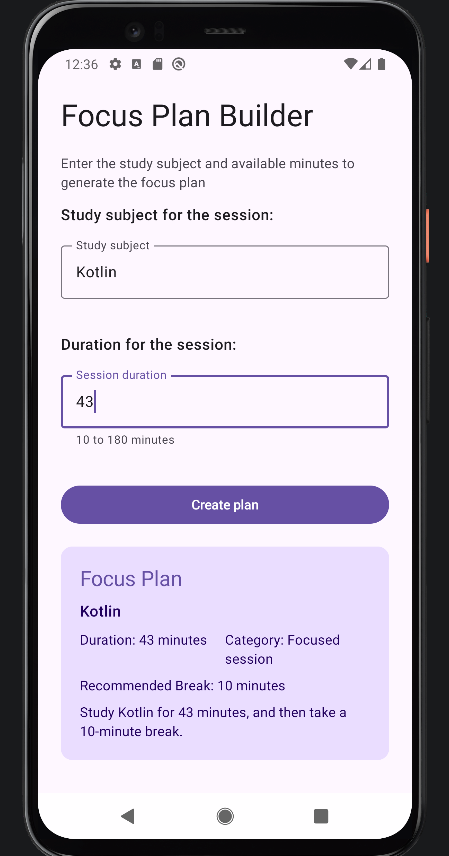
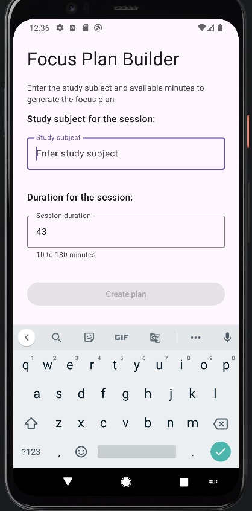
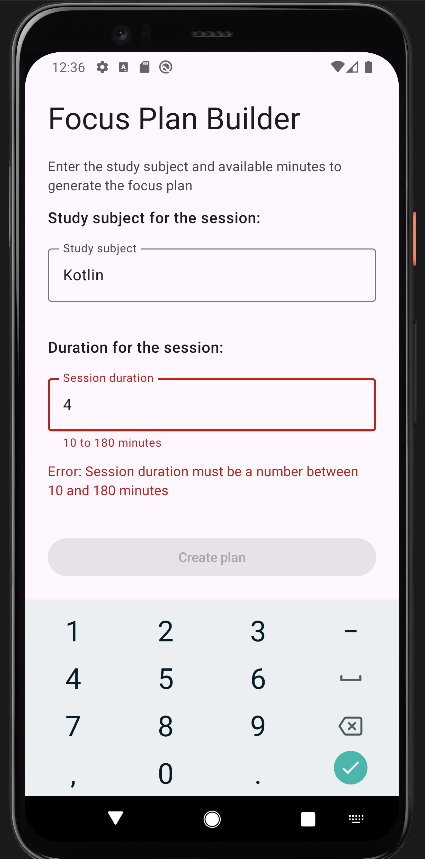
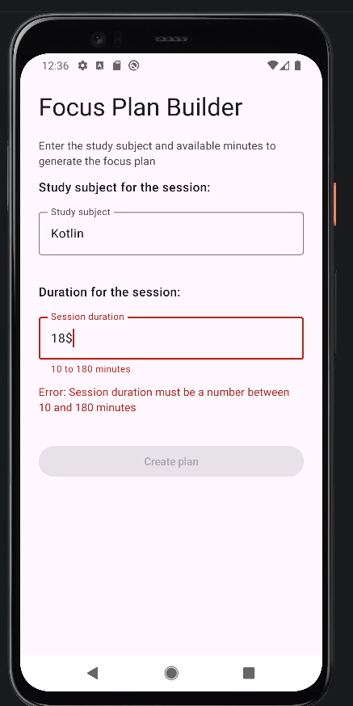
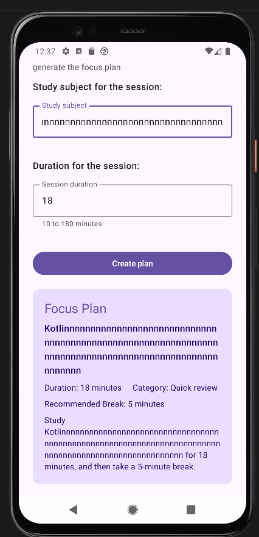
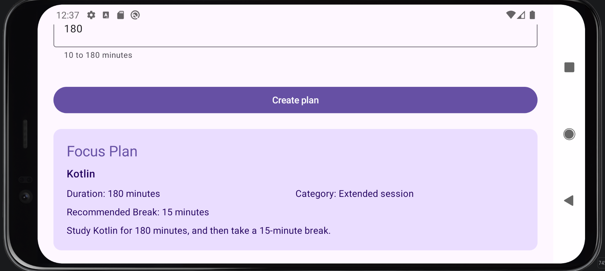

# Focus Plan Builder

**Name:** Jerin Joseph

**Assignment:** Focus Plan Builder Application

## Description

Focus Plan Builder is a single-screen Android app that helps a student plan a study session. The user enters a subject and the number of minutes available. The app checks the input and creates a plan that shows the subject, the session length, a duration category, a recommended break and a short summary.

The app is built with Kotlin, Jetpack Compose and Material 3.

## How to Run

1. Clone the repository:
   ```bash
   git clone https://github.com/jerinjoseph121/focus-plan-builder-assignment-2.git
   ```
2. Open the cloned `focus-plan-builder-assignment-2` folder in Android Studio.
3. Wait for the Gradle sync to finish.
4. Start an emulator or connect a device running Android 8.0 (API 26) or higher.
5. Select the `app` run configuration and click **Run**.

## Screenshot



### Other states

| Blank subject | Duration out of range | Nonnumeric duration |
|---|---|---|
|  |  |  |

| Long subject | Landscape after rotation |
|---|---|
|  |  |

## State and Recomposition

`FocusPlanRoute` owns the app state. It holds `subject`, `minutesText` and `focusPlan`, validates the input and creates the plan. `FocusPlanScreen` only displays these values and reports user actions through callbacks.

The text fields store their values as `String` because a text field works with text. The user can type an empty value, a partial value or something like `abc`, and an `Int` can't represent any of those. The number is converted separately when it is needed.

`toIntOrNull()` returns `null` for input like `""`, `abc` or `18$`. `toInt()` would throw an exception and crash the app. With `null`, the button stays disabled.

The button recomposes when `subject` or `minutesText` changes. Each keystroke updates that state, `FocusPlanRoute` recomposes, and `canCreatePlan` is recalculated and passed to the button.

`rememberSaveable` stores the values in a Bundle, so they survive the Activity being recreated on rotation. A local variable would reset on every recomposition. The plan uses `remember` because a data class can't be stored in a Bundle.

## Testing

All cases below were tested on the emulator.

| Subject | Duration | Expected result |
|---|---|---|
| Blank | 25 | Button disabled |
| Kotlin | Blank | Button disabled |
| Kotlin | abc | Button disabled, no crash |
| Kotlin | 9 | Button disabled |
| Kotlin | 10 | Quick review, 5-minute break |
| Kotlin | 29 | Quick review, 5-minute break |
| Kotlin | 30 | Focused session, 10-minute break |
| Kotlin | 60 | Focused session, 10-minute break |
| Kotlin | 61 | Extended session, 15-minute break |
| Kotlin | 180 | Extended session, 15-minute break |
| Kotlin | 181 | Button disabled |

I also checked that the app does not crash when the duration is erased, that both inputs survive rotation, that the old result disappears when an input changes, and that the button enables and disables as the input changes.

## AI Use

**Tool used:** Claude (Anthropic), through the Claude desktop app.

**What it helped with:** I built the project structure, composables, state, validation and calculation functions myself. I then used Claude for a reminder of the Git setup steps and a review of my code. It found the cause of a crash on rotation: I was storing the `FocusPlan` in `rememberSaveable`, which can't save a data class. It also pointed out requirements I had missed.

**What I changed or verified:** I did not use the full rewrite it first suggested. I asked for small changes and typed them in myself, keeping my own names, structure and text. I applied the rotation fix (using `remember` for the plan and removing `isDisplayCard`), the numeric keyboard, the "Create plan" label, a `Row` in the result card, the error state on the duration field and a few styling changes to the card.

**How I confirmed my understanding:** I ran every test case above on the emulator, including rotating with a plan on screen. I can explain why the crash happened and why `remember` fixes it.
